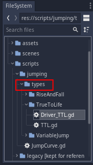

# Better Jump Models in Godot Game Engine
Traditionally a character's jump is defined through trial and error. This is time consuming and not flexible enough when making changes to level design. Instead we define a jump by with height (peak of the jump) and distance. 


## Installation
1. Clone the repository 
```bash
git clone https://github.com/sosa256/better-jumping.git
```
2. Open Godot

3. Select the "Import" button 


4. Select the project.godot file from the cloned repository


## Usage
You can change the player's jump model by replacing the script attached to the "Player" node with a different one. The scripts can be found in their respective folder's within the "types" folder. Make sure to attach the driver script.



There are 3 different types of jump models

1. **True to life** 
    - Simulates a real world projectile (ignoring air resistance of course)
   - User can define max height and max distance 
2. **Rise and fall** 
    - User can modify each half (hence the name) of the jump's characteristics
    - User can define max height and max distance 
3. **Variable jump** 
    - The jump can be responsive to when the user releases the jump button 
    - User can modify each half of the jump
    - User can define max height and max distance 

Each jump can have it's characteristics modified through the Godot editor
Examples of each jump model


